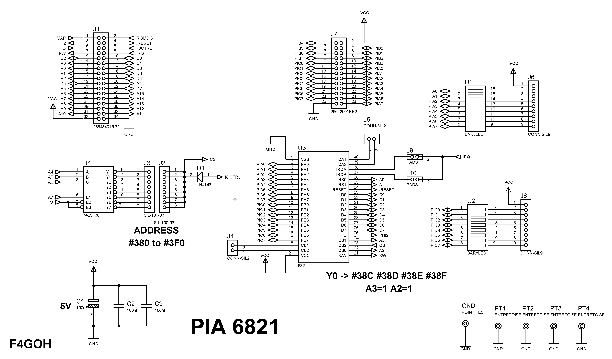
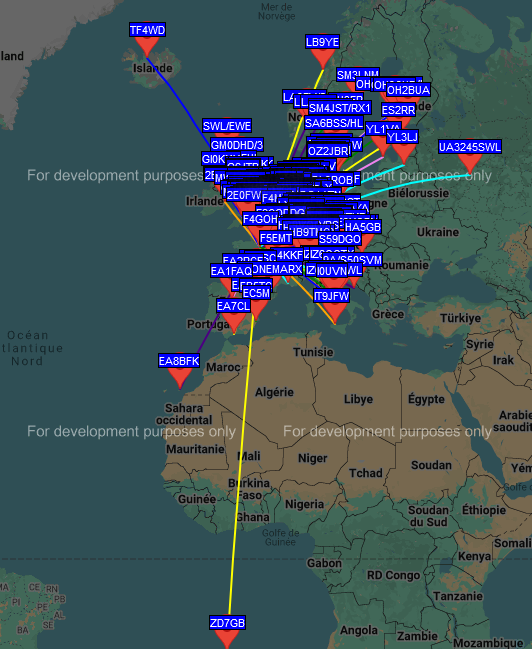

Retrocomputing is back in style with a handcrafted HF beacon driven by an ORIC ATMOS. Equipped with a PI6821 and DDS9850, it proudly transmits its signals, powered by a compact 4KB 6502 assembly code. This technical feat highlights the elegance of an era when every byte mattered. In contrast to today’s memory-hungry machines, it proves that brilliance lies not in excess, but in ingenuity.

# HF BEACON with an ORIC ATMOS

- WSPR, RTTY, PS31, CW
- GPS
- PIA 6821
- ATTiny85 (parse NMEA)
- Power 500mW
- VCC supply 5V
- Software : Basic and ASM 6502 4Ko

# Schematics

# First WSPR test

# The OLD an great pia 6821

