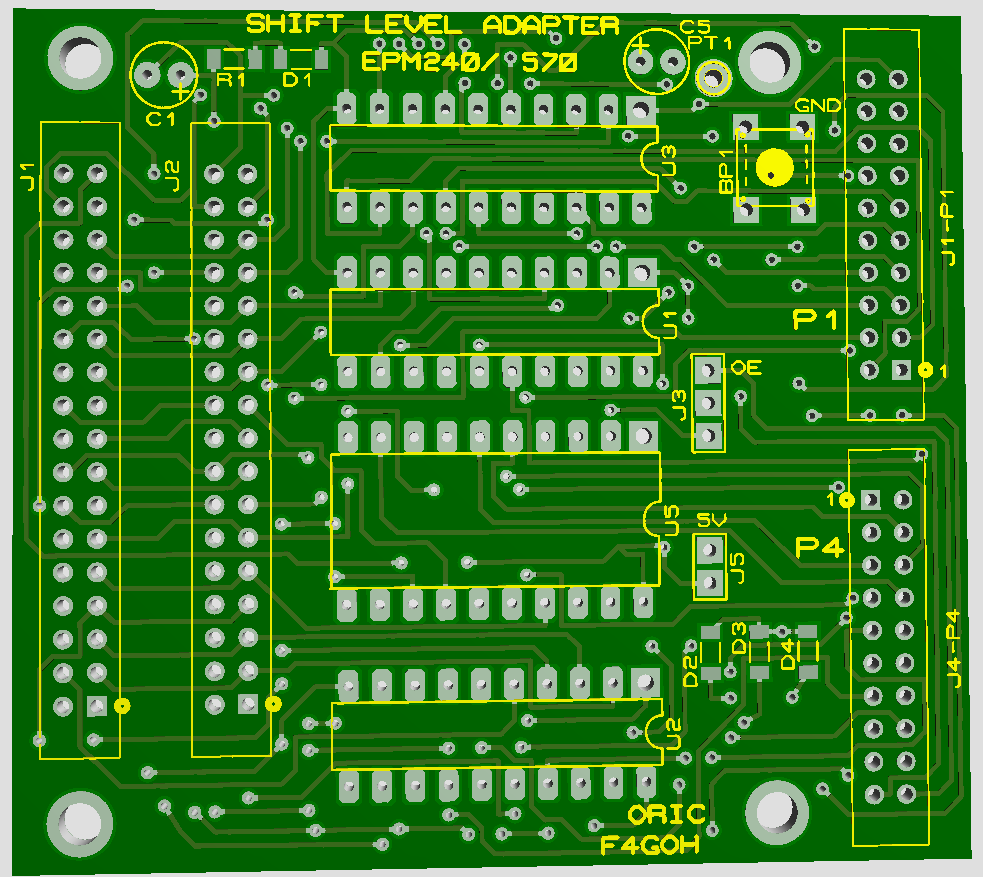

# Adaptateur 3.3 Volts pour FPGA

## Projet expérimental

- La carte est concue pour etre connectée sur un FPGA EPM240 ou EPM570
- Elle utilise trois sn74lvc245a pour le bus d'adresse, de controle et un txb0108 pour le bus de donnée
- Un sn74lvc07a permet de gérer les retours pour IOCtrl, IRQ, ROMDIS, MAP

Projet en cours de construction

