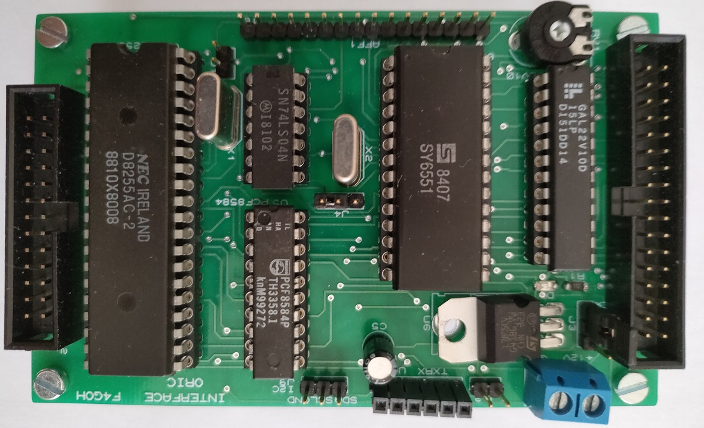
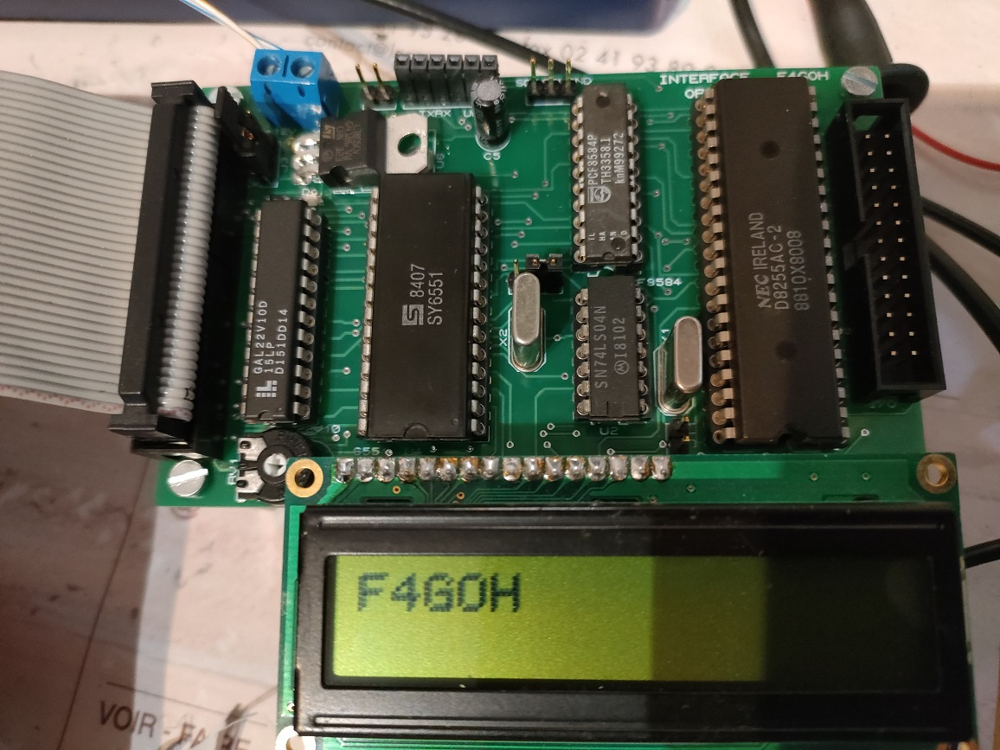

# Carte Entrée Sortie UART et I2C

Ce projet est la raison d'être pour re-sortir l'Oric-1 de son armoire.



## Caractéristiques:

- Décodage d'adresse GAL22V10
- PIA 8255
- UART 6551
- I2C PCF8584
- Port Afficheur LCD 2x16

- Le fichier JED de la GAL est générée avec l'utilitaire [GALasm](https://github.com/daveho/GALasm) sous linux.
- le programmateur utilisé est un [XGECU - pro](https://www.aliexpress.com/premium/XGecu.html)
- Il est capable de programmer les EEPROM et la GAL22V10 de Lattice

| Prériphérique | Adresse |
| ------ | ------ |
| 8255 | #3F0 |
| 6551 | #3F4 |
| PCF8584 | #3F8 |
| Afficheur | #3FC |
| Led test | #3FC |



```c
Bientôt des exemples...en basic et en c
```


