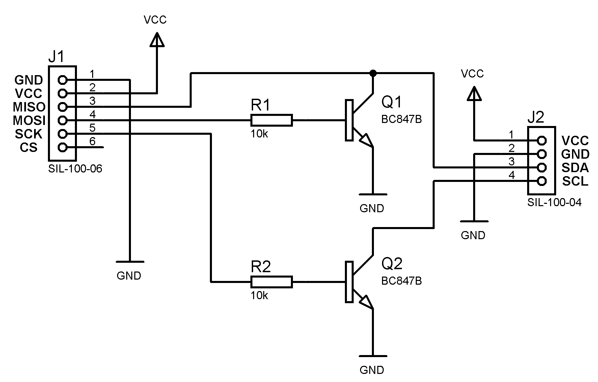

# Erebus I²C
## _Utilisation de l'EREBUS comme bus I²C

#Contenu du dépot

- bas : les programmes en BASIC
- I2C_Basic : programmme pour OSDK
- pdf : la documentation pdf des périphériques supportés par l'oric
- Slave_uno : un programme de démo pour un Arduino Uno en mode Esclave I²C
- tap : les fichiers tap de démonstration correspondant aux fichiers en BASIC

#Remarque
Pour tester les programmes en BASIC il faut copier le code dans le
fichier main.bas du dossier projet I2C_Basic puis
exécuter le fichier osdk_build.bat pour générer le fichier tap

Oric Software Development kit [OSDK](https://osdk.org/)

