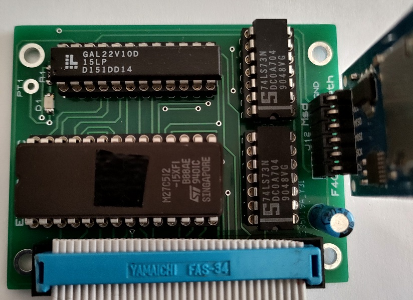
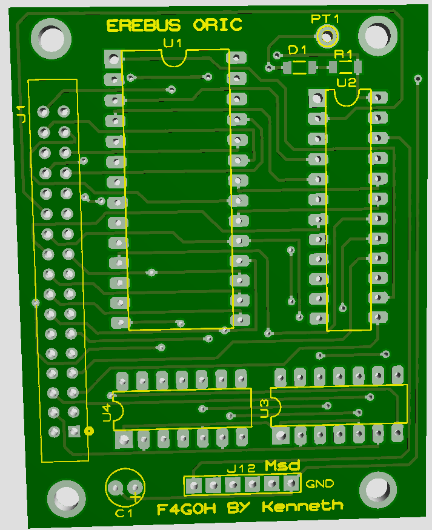

# Erebus
## _Version avec une GAL22V10_

# [D'après kenneth](http://retrowiki.es/download/file.php?id=200028923) 

- Le fichier JED de la GAL est générée avec l'utilitaire [GALasm](https://github.com/daveho/GALasm) sous linux.
- le programmateur utilisé est un [XGECU - pro](https://www.aliexpress.com/premium/XGecu.html)
- Il est capable de programmer les EEPROM et la GAL22V10 de Lattice

Autre version de l'Erebus par [Fred72](https://github.com/Fred72z/ORIC/tree/main/BUS_ORIC/Extensions/Erebus)

