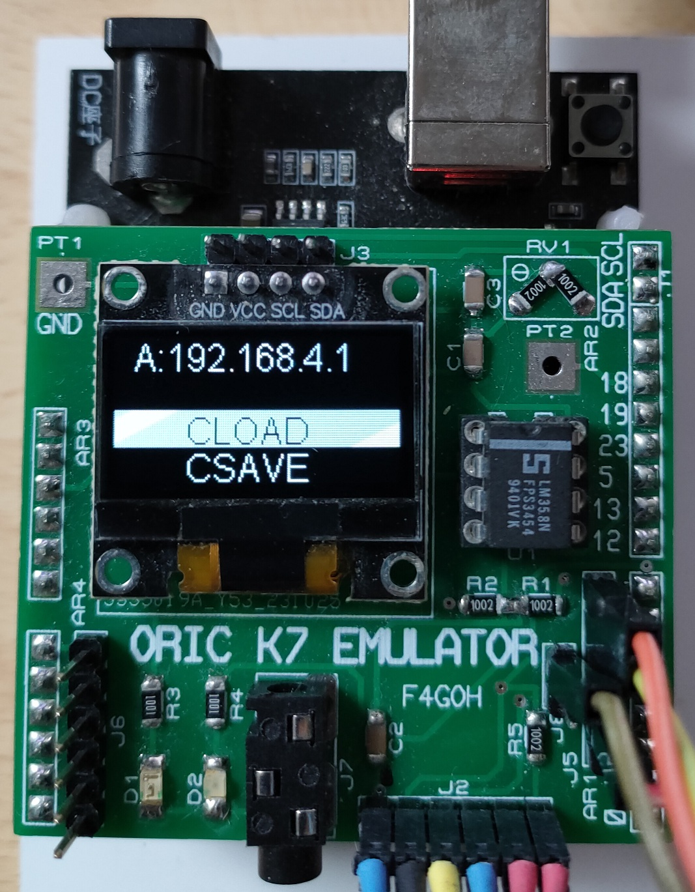
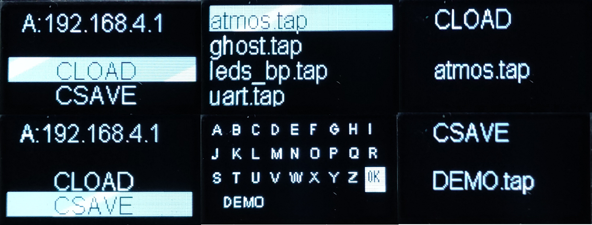
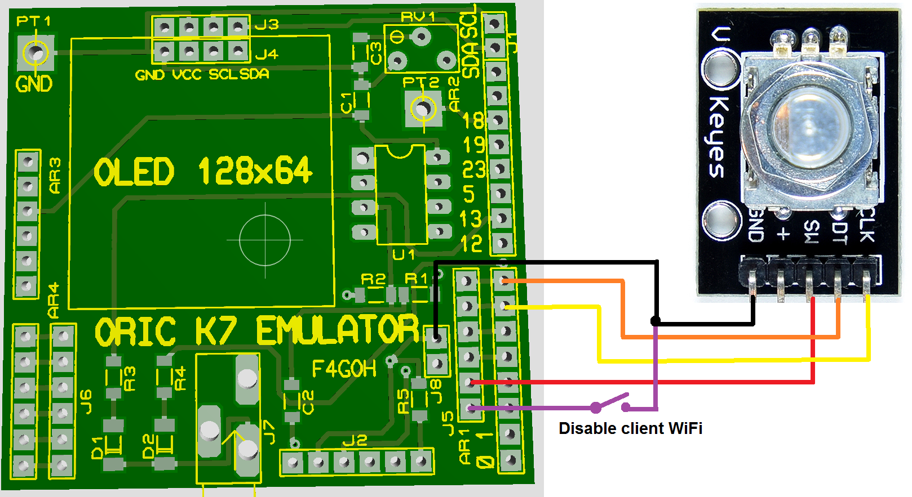
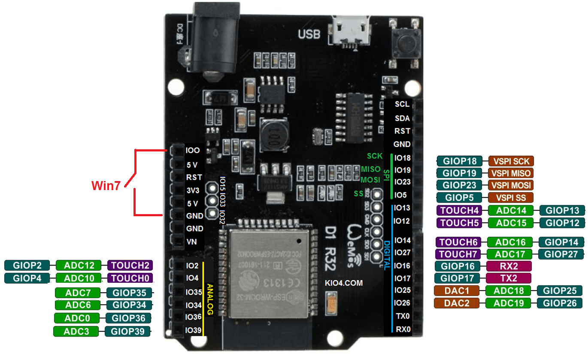
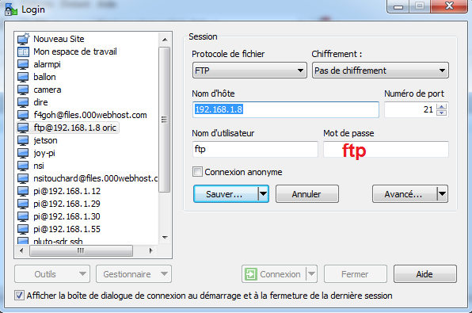
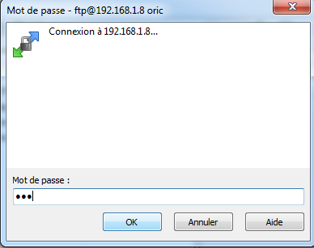
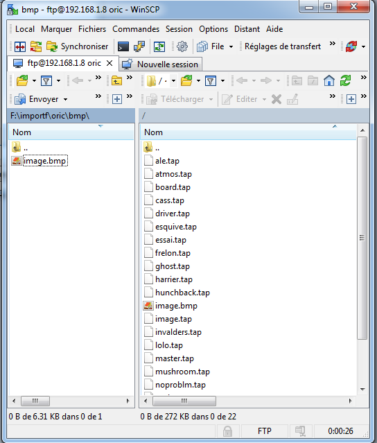
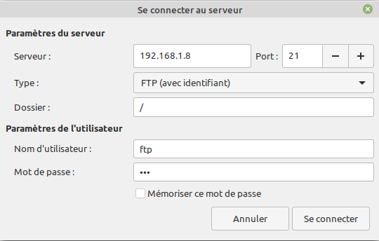
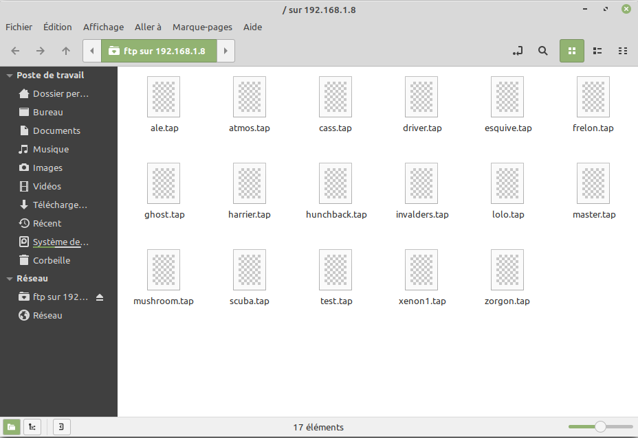

# Oric K7 emulator

## Automatic installation in esp32 [firmwares](https://f4goh.github.io/oric/index.html) 




## Introduction

It's already been two years since I built my 'home' ORIC. As a reminder, I created a tape emulator using an ESP32. I then developed a version that could be used on 'real' ORICs.
But it required a PC to select the file to be played or recorded. Not very practical when you want to give a demonstration outside the house.

The addition of an OLED display and rotary encoder solves this problem. It is now possible to load and save TAP files without the need for a wifi connection or a remote PC.


## K7 Emulator Features
- CLOAD function
- CSAVE function
- Stand alone function with rotary encoder
- FTP transfert tap files into ESP32 (login ftp, password ftp)
- Serial 115200 and TELNET Console admin
- Show Basic tap program
- Convert BMP monochrome file to tap
- TELNET Serial function for 6551 UART
- Access point (SSID : ORIC_AP , password : oricatmos)
- Gerber file available
- Low cost (ESP32duino and LM358)



# Schematics


I chose a version of ESP32 called "Esp32 duino". This is an ESP32 that looks like an Arduino UNO board, with the same input/output pin spacing.
All that's left is to make an adapter called a "shield". The PCB has an OLED display and an LM358 operational amplifier. The AOP (single threshold comparator) is needed to shape the signal for correct recording. The signal is not really square. Finally, there is no particular adjustment to be made. The useless potentiometer can be replaced by two 10K resistors connected in a voltage divider bridge. 
The rest of the printed circuit is for connection purposes.
The J3/J4 connector prevents errors when wiring an SSD1306 OLED display. It has two versions in pinout order.
(GND, VCC, SCL, SDA(J4) and VCC, GND, SCL, SDA(J3)). Care must be taken during assembly to ensure that the wrong version is used. The two LEDs D1 and D2 are not used for the moment.
The remote function is also used. Once the TAP file has been selected, the emulator waits for the CLOAD command on the ORIC before sending the data.
I also took the ORIC's unamplified sound output. This is connected directly to a female 3.5 JACK socket.
Six pins of the DIN plug are used.


# Rotary encoder wiring




The rotary encoder is very easy to use (as in GOTEK players). Briefly press the encoder cursor to load or save.
In load mode, the list of files is displayed on the OLED screen. Selecting a file immediately switches to theLOAD stage.
In save mode, the same principle applies, but you must first enter a file name without the TAP extension, which is added automatically.


# ESP32DUINO




There's no need to recompile everything, I've made the binary file available. The programming utility is online. All you have to do is load the web page with Google Chrome (this browser allows COMx serial ports to be used online).
Programming is very practical and fast. However, on an older OS such as Windows 7, you will need to connect a wire between the GPIO0 pin and ground before pressing the RESET button to force bootloader mode into programming mode. There is no need to do this under Linux.


# Serial console 115200 bauds


Its primary function is to play back and record TAP files. Please note that there is no mSD card reader - this is deliberate. The only way to load TAP files into the internal spiffs partition is to link the emulator to a WiFi access point, as the ESP32 manages a mini FTP server. 
To do this, connect an ESP32 micro USB cable to a PC. Then, using a serial terminal such as putty (115200 bauds), enter the ssid and password for the WiFi access point.

Exemple :
```console
ssid Livebox-C000
pass totototo
reboot
```

After rebooting the ESP32 (reboot command), note the IP address assigned to the ORIC by the WiFi access point. The IP address is also displayed on the OLED screen.
Next, as shown in the screenshots, you will need to use (for example) the winscp utility to copy the TAP files to the ESP32 using the FTP protocol. (user ftp, pass ftp). The storage size is 1378241 bytes, but I've seen that you can change the size of the SPIFFS partition (not tested). This is still small, but do we need to have the entire collection of TAP ORIC files in memory?
If you use the emulator outside your home, and therefore outside the access point. You will need to disable the automatic connection. To do this, a closed switch between ground and GPIO26(J5) switches the ESP32 to WIFI access point mode. The commands can be entered using a Smartphone. (Android Mobile Telnet and AndFTP utilities for example)


## Initialization

```console
INIT-------------------------------------
>console start
ORIC connected to any local access point
SFR_6C4F
Client Wifi
Connected to access point
ETH MAC: 7C:9E:BD:61:9C:74Obtained IP address: 192.168.1.8
.
WiFi connecté
Adresse IP : 192.168.1.8
Adresse IP de la gateway : 192.168.1.1
Wifi Enable
- Telnet: running
```

## Help 

```console
Oric> help
Available commands
Set ssid                        : ssid mywifi
Set password                    : pass toto
ls                              : list tap files in SPIFFS
info                            : SPIFFS info space size
rm filename.tap                 : remove tap files in SPIFFS
cload filename.tap              : load fsk from esp32 to oric
csave filename.tap              : save fsk from oric to esp32
view filename.tap               : view file content in HEX/ASCII format
basic filename.tap              : view file content in BASIC
conv source.bmp dest.tap        : convert bmp monochrome image to tap file
des source.tap dest.txt         : dessasemble tap file to txt file
Enable serial for telnet        : serial 1
Enable wifi                     : internet 1
Enable local wifi Access Point  : internet 0
Show configuration              : show
Reset default configuration     : raz
Format SPIFFS                   : format
Reboot ESP32                    : reboot
help                            : this menu
F4GOH : Version 2.0
Oric>
```
It is not essential to use the USB connector as a serial link all the time. It is possible to send commands via WiFi using the Telnet protocol, but the possibilities are limited.

## Show configuration

```console
Oric> show
Ssid is             : SFR_6C4F
password is         : xxxxxxxxxxxxxx
Serial is           : Disable
Internet is         : Enable
TCP Access point is : Disable
```
## List files in ESP32 SPIFFS

```console
Oric> ls
invalders.tap          11790
hunchback.tap          24025
ghost.tap              17590
zorgon.tap             37396
mushroom.tap           8216
frelon.tap             27057
driver.tap             19497
xenon1.tap             37396
esquive.tap            10836
harrier.tap            11726
cass.tap               1458
scuba.tap              13782
master.tap             76
ale.tap                87
atmos.tap              34
noproblm.tap           35729
board.tap              8052
test.tap               8052
lolo.tap               85
essai.tap              87
image.bmp              6462
```
## Play tap file to Oric

```console
Oric> cload essai.tap
Attente CLOAD"

Tap txing...Wait
Sending sync bytes
Sending header

Size: 74
73
finished
```
## Print Basic tap program

```console
Oric> basic essai.tap
 10 PRINT "HELLO"
 20 FOR N = 1 TO 10
 25 PRINT N
 30 ZAP
 40 NEXT N
 50 EXPLODE
```
## Save tap file from Oric
```console
Oric> csave test.tap
En Attente du CSAVE...
Wait CSAVE"
Synchro found, decoding bytes...

taille du fichier : 87
```
## Check if is good with basic command
```console
Oric> basic test.tap
 10 PRINT "HELLO"
 20 FOR N = 1 TO 10
 25 PRINT N
 30 ZAP
 40 NEXT N
 50 EXPLODE
```
## Convert BMP image to tap file
```console
Oric> conv
Usage conv source.bmp dest.tap
Must be 240x200 in monochome BMP
Oric> conv image.bmp image.tap
conversion
54
4D42
193E
240
200
1
62
```
## Check if the tap fil is here and load it to Oric
```console
Oric> ls
...
image.bmp              6462
test.tap               87
image.tap              8052
Oric> cload image.tap
Attente CLOAD"

Tap txing...Wait
Sending sync bytes
Sending header
HIRLOAD
Size: 17
Sending sync bytes
Sending header

Size: 8000
7999
finished
```
## desassemble tap file if 0x80 in 1st header
```console
Oric> des test.tap test.txt
Try to desassemble tap file
File size : 0043
Start Address : 0600
End Address : 0631
File name : FILE
Offset code : 0012
Size code : 0031
File /test.txt generated
Oric>
```
## Result in test.txt
```console
$0600> A2 00:   LDX #$00        ;
$0602> A9 14:   LDA #$14        ;
$0604> 9D D0BB: STA $BBD0,X     ; SCREEN
$0607> E8:      INX             ;
$0608> A9 15:   LDA #$15        ;
$060A> 9D D0BB: STA $BBD0,X     ; SCREEN
$060D> E8:      INX             ;
$060E> E0 28:   CPX #$28        ;
$0610> D0 F0:   BNE $0602       ;
$0612> A9 12:   LDA #$12        ;
$0614> 8D F8BB: STA $BBF8       ; SCREEN
$0617> A9 01:   LDA #$01        ;
$0619> 8D F9BB: STA $BBF9       ; SCREEN
$061C> A9 4F:   LDA #$4F        ;
$061E> 8D FABB: STA $BBFA       ; SCREEN
$0621> A9 52:   LDA #$52        ;
$0623> 8D FBBB: STA $BBFB       ; SCREEN
$0626> A9 49:   LDA #$49        ;
$0628> 8D FCBB: STA $BBFC       ; SCREEN
$062B> A9 43:   LDA #$43        ;
$062D> 8D FDBB: STA $BBFD       ; SCREEN
$0630> 60:      RTS             ;
```
## desassemble tap file if 0x80 in 2nd header
```console
Oric> des lm75read.tap lm75read.txt
desassemble tap file
File size : 0505
Start Address : 0501
End Address : 05bf
File name :  main
Offset code : 0013
Size code : 00be
Basic detected
Try to find asm code
Start Address : 8000
End Address : 8420
File name : OSDK
Offset code : 00e4
Size code : 0420
asm find
```

The "des source.tap dest.txt" command disassembles a tap file into a text file. I added this possibility more for the experimental side. The Oric explorer utility does much better.
Ditto for the "conv source.bmp dest.tap" command, the idea is to convert an uncompressed black and white BMP image into a TAP file. The image must first be in ORIC format.

## View file in HEX/ASCII
```console
Oric> view lolo.tap
16 16 16 24 00 00 00 00 05 48 05 01 00 00 07 05    ...$.....H......
05 00 94 00 15 05 0A 00 8D 20 4E D4 30 20 C3 20    ......... N.0 .
37 00 1D 05 14 00 B2 20 4E 00 2E 05 1E 00 BA 20    7...... N......
22 4C 41 55 52 45 4E 43 45 22 00 38 05 28 00 B1    "LAURENCE".8.(..
20 37 CD 4E 00 3E 05 32 00 A5 00 46 05 3C 00 90     7.N.>.2...F.<..
20 4E 00 00 00                                      N...
```
## Show total space in ESP32 SPIFFS
```console
Oric> free

===== Flash File System Info =====
Total space:      1378241 octets
Total space used: 288650 octets
```
# Telnet console
```console
Welcome 192.168.1.111

Oric> help
Available telnet commands
ls                 : list tap files in SPIFFS
free               : SPIFFS info space size
rm filename.tap    : remove tap files in SPIFFS
cload filename.tap : load fsk from esp32 to oric
csave filename.tap : save fsk from oric to esp32
view filename.tap  : view file content in HEX/ASCII format
basic filename.tap : view file content in BASIC
help               : this menu
bye                : exit telnet
F4GOH : Version 1.0

Oric>
```

# FTP under windows (Winscp)
FTP transfert with Winscp



## Login : ftp ,Password : ftp





# FTP under linux





The tape emulator has finally reached a near-final version. Corrections will probably be made as far as possible and depending on feedback. The emulator can very well be made on a perforated plate, but using a printed circuit board makes it easier to use. This project is redundant in relation to the EREBUS and LOCI, but the extension port is still available. If anyone is interested, I can make a specific CEO print and pre-assemble the few SMD components.

See you soon

Anthony

F4GOH

