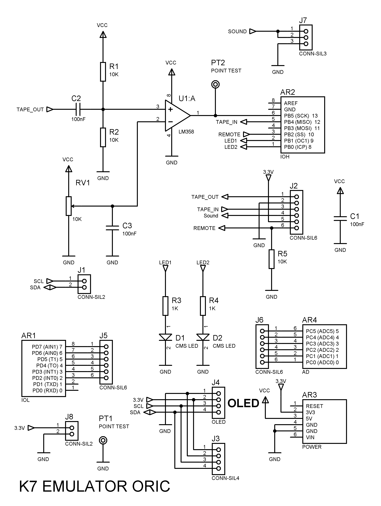
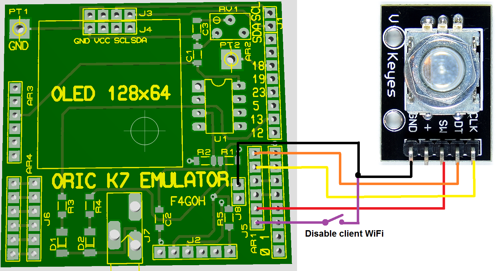

# Oric K7 emulator

## Automatic installation in esp32 [firmwares](https://f4goh.github.io/oric/index.html) 


K7 Emulator Features
- CLOAD function
- CSAVE function
- Stand alone function with rotary encoder
- FTP transfert tap files into ESP32 (login ftp, password ftp)
- Serial and TELNET Console admin
- Show Basic tap program
- Convert BMP monochrome file to tap
- TELNET Serial function for 6551 UART
- Access point 
- Gerber file available
- Low cost (ESP32duino and LM358)


# Serial console 115200 bauds

# Schematics



# Rotary encoder wiring



# ESP32DUINO


## Initialization

```console
INIT-------------------------------------
>console start
ORIC connected to any local access point
SFR_6C4F
Client Wifi
Connected to access point
ETH MAC: 7C:9E:BD:61:9C:74Obtained IP address: 192.168.1.8
.
WiFi connecté
Adresse IP : 192.168.1.8
Adresse IP de la gateway : 192.168.1.1
Wifi Enable
- Telnet: running
```

## Help 

```console
Oric> help
Available commands
Set ssid                        : ssid mywifi
Set password                    : pass toto
ls                              : list tap files in SPIFFS
info                            : SPIFFS info space size
rm filename.tap                 : remove tap files in SPIFFS
cload filename.tap              : load fsk from esp32 to oric
csave filename.tap              : save fsk from oric to esp32
view filename.tap               : view file content in HEX/ASCII format
basic filename.tap              : view file content in BASIC
conv source.bmp dest.tap        : convert bmp monochrome image to tap file
des source.tap dest.txt         : dessasemble tap file to txt file
Enable serial for telnet        : serial 1
Enable wifi                     : internet 1
Enable local wifi Access Point  : internet 0
Show configuration              : show
Reset default configuration     : raz
Format SPIFFS                   : format
Reboot ESP32                    : reboot
help                            : this menu
F4GOH : Version 2.0
Oric>
```
## Show configuration

```console
Oric> show
Ssid is             : SFR_6C4F
password is         : xxxxxxxxxxxxxx
Serial is           : Disable
Internet is         : Enable
TCP Access point is : Disable
```
## List files in ESP32 SPIFFS

```console
Oric> ls
invalders.tap          11790
hunchback.tap          24025
ghost.tap              17590
zorgon.tap             37396
mushroom.tap           8216
frelon.tap             27057
driver.tap             19497
xenon1.tap             37396
esquive.tap            10836
harrier.tap            11726
cass.tap               1458
scuba.tap              13782
master.tap             76
ale.tap                87
atmos.tap              34
noproblm.tap           35729
board.tap              8052
test.tap               8052
lolo.tap               85
essai.tap              87
image.bmp              6462
```
## Play tap file to Oric

```console
Oric> cload essai.tap
Attente CLOAD"

Tap txing...Wait
Sending sync bytes
Sending header

Size: 74
73
finished
```
## Print Basic tap program

```console
Oric> basic essai.tap
 10 PRINT "HELLO"
 20 FOR N = 1 TO 10
 25 PRINT N
 30 ZAP
 40 NEXT N
 50 EXPLODE
```
## Save tap file from Oric
```console
Oric> csave test.tap
En Attente du CSAVE...
Wait CSAVE"
Synchro found, decoding bytes...

taille du fichier : 87
```
## Check if is good with basic command
```console
Oric> basic test.tap
 10 PRINT "HELLO"
 20 FOR N = 1 TO 10
 25 PRINT N
 30 ZAP
 40 NEXT N
 50 EXPLODE
```
## Convert BMP image to tap file
```console
Oric> conv
Usage conv source.bmp dest.tap
Must be 240x200 in monochome BMP
Oric> conv image.bmp image.tap
conversion
54
4D42
193E
240
200
1
62
```
## Check if the tap fil is here and load it to Oric
```console
Oric> ls
...
image.bmp              6462
test.tap               87
image.tap              8052
Oric> cload image.tap
Attente CLOAD"

Tap txing...Wait
Sending sync bytes
Sending header
HIRLOAD
Size: 17
Sending sync bytes
Sending header

Size: 8000
7999
finished
```
## desassemble tap file if 0x80 in 1st header
```console
Oric> des test.tap test.txt
Try to desassemble tap file
File size : 0043
Start Address : 0600
End Address : 0631
File name : FILE
Offset code : 0012
Size code : 0031
File /test.txt generated
Oric>
```
## Result in test.txt
```console
$0600> A2 00:   LDX #$00        ;
$0602> A9 14:   LDA #$14        ;
$0604> 9D D0BB: STA $BBD0,X     ; SCREEN
$0607> E8:      INX             ;
$0608> A9 15:   LDA #$15        ;
$060A> 9D D0BB: STA $BBD0,X     ; SCREEN
$060D> E8:      INX             ;
$060E> E0 28:   CPX #$28        ;
$0610> D0 F0:   BNE $0602       ;
$0612> A9 12:   LDA #$12        ;
$0614> 8D F8BB: STA $BBF8       ; SCREEN
$0617> A9 01:   LDA #$01        ;
$0619> 8D F9BB: STA $BBF9       ; SCREEN
$061C> A9 4F:   LDA #$4F        ;
$061E> 8D FABB: STA $BBFA       ; SCREEN
$0621> A9 52:   LDA #$52        ;
$0623> 8D FBBB: STA $BBFB       ; SCREEN
$0626> A9 49:   LDA #$49        ;
$0628> 8D FCBB: STA $BBFC       ; SCREEN
$062B> A9 43:   LDA #$43        ;
$062D> 8D FDBB: STA $BBFD       ; SCREEN
$0630> 60:      RTS             ;
```
## desassemble tap file if 0x80 in 2nd header
```console
Oric> des lm75read.tap lm75read.txt
desassemble tap file
File size : 0505
Start Address : 0501
End Address : 05bf
File name :  main
Offset code : 0013
Size code : 00be
Basic detected
Try to find asm code
Start Address : 8000
End Address : 8420
File name : OSDK
Offset code : 00e4
Size code : 0420
asm find
```


## View file in HEX/ASCII
```console
Oric> view lolo.tap
16 16 16 24 00 00 00 00 05 48 05 01 00 00 07 05    ...$.....H......
05 00 94 00 15 05 0A 00 8D 20 4E D4 30 20 C3 20    ......... N.0 .
37 00 1D 05 14 00 B2 20 4E 00 2E 05 1E 00 BA 20    7...... N......
22 4C 41 55 52 45 4E 43 45 22 00 38 05 28 00 B1    "LAURENCE".8.(..
20 37 CD 4E 00 3E 05 32 00 A5 00 46 05 3C 00 90     7.N.>.2...F.<..
20 4E 00 00 00                                      N...
```
## Show total space in ESP32 SPIFFS
```console
Oric> free

===== Flash File System Info =====
Total space:      1378241 octets
Total space used: 288650 octets
```
# Telnet console
```console
Welcome 192.168.1.111

Oric> help
Available telnet commands
ls                 : list tap files in SPIFFS
free               : SPIFFS info space size
rm filename.tap    : remove tap files in SPIFFS
cload filename.tap : load fsk from esp32 to oric
csave filename.tap : save fsk from oric to esp32
view filename.tap  : view file content in HEX/ASCII format
basic filename.tap : view file content in BASIC
help               : this menu
bye                : exit telnet
F4GOH : Version 1.0

Oric>
```

# FTP under windows (Winscp)
FTP transfert with Winscp


Password : ftp


# FTP under linux


