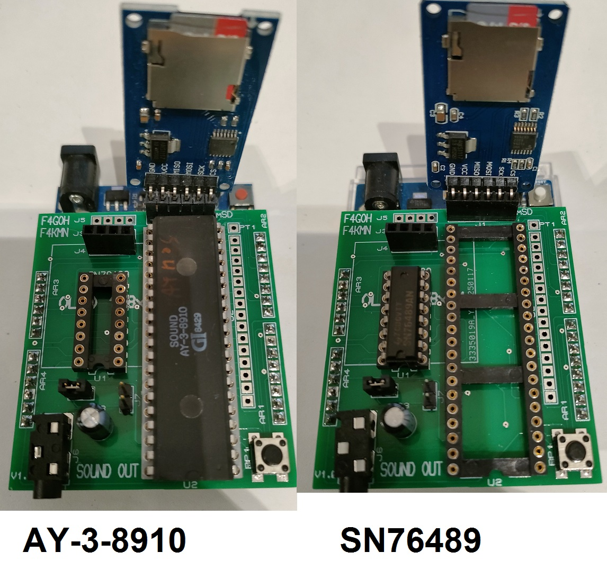

# AY-3-8910 or SN76489
AY-3-8910 or SN76489 Sound Generator PCB controlled by Arduino Uno

This project aims to test integrated circuits very quickly. just put some YM files into mSD card.
The arduino uno reads the YM file and sends the notes to the ay-3-8910.
have fun with AY38910_Demo_YM_Player.ino

For SN76489 you will need to use VGM files. the program MD_SN76489_VGM_Player_CLI.ino is functional.
I haven't yet found the bug to read midi files with the SN76489.

The two integrated circuits should never be used at the same time.
The J8 strap must be closed and the J7 strap open.




# Schematics


# PCB


# Software

Beware the sdfat library for sn76489 is the version [1.1.1](https://github.com/greiman/SdFat/releases?page=2)


ym files downloaded from the internet need to be decompressed
Use ymextract_x64 under linux OS

```console
./ymextract_x64 SWIV.YM test.ym

Reading 133680 bytes
File is YM5/YM6
  Frames: 8348
  At./ymextract_x64 SWIV.YM test.ym
Reading 133680 bytes
File is YM5/YM6
  Frames: 8348
  Attrib: 0x0001
   Clock: 2000000 Hz
    Rate: 50 Hz
    Name: Swiv - Silkworm IV
  Author: Andrew Barnabas (Nightshade)
 Comment: Converted by Alain Derpin
trib: 0x0001
   Clock: 2000000 Hz
    Rate: 50 Hz
    Name: Swiv - Silkworm IV
  Author: Andrew Barnabas (Nightshade)
 Comment: Converted by Alain Derpin
```

# Links

[YM format](http://leonard.oxg.free.fr/ymformat.html)

[Some YM files ](https://www.dazeland.com/Dazeland2000/Musica.html)

[Some YM files again](https://pacidemo.planet-d.net/html.html)

[Initial source project](https://github.com/GadgetReboot/AY-3-8910/)


