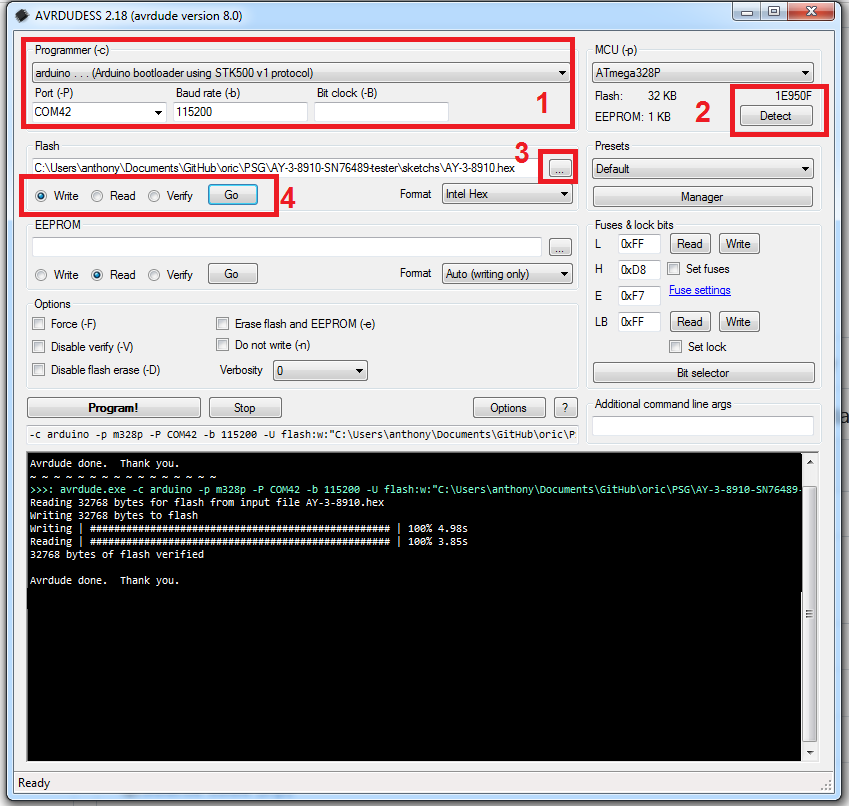

# AY-3-8910 or SN76489

Quick programming with [AVRDUDESS 2.18](https://github.com/ZakKemble/AVRDUDESS/releases)



AY-3-8910.hex is  AY38910_Demo_YM_Player.ino.

Push button to skip YM file in the mSD card.

SN76489.hex is MD_SN76489_VGM_Player_CLI.ino.

Serial terminal 57600 bauds

```console
[MD_SN74689 VGM Player CLI]
Ensure serial monitor line ending is set to newline.
h 	help
? 	help
f fldr	set current folder to fldr
l 	list files in current folder
p file	play the named file ex : p 07NOEL.VGM
s 	stop playing current file
z 	software reset
01WE_WISH.VGM
02KQ3.VGM
03XMAS.VGM
04RUDOLF.VGM
05SNIGHT.VGM
06JBELLS.VGM
07NOEL.VGM
08FROSTY.VGM
09SQ.VGM
10OASIS2.VGM
test.vgm
SKYFALL.MID
ELISE.MID
MOZART.MID
POPCORN.MID


VGM file: 03XMAS.VGM
VGM version: 0x151
SN76489 clock: 3579545

```
