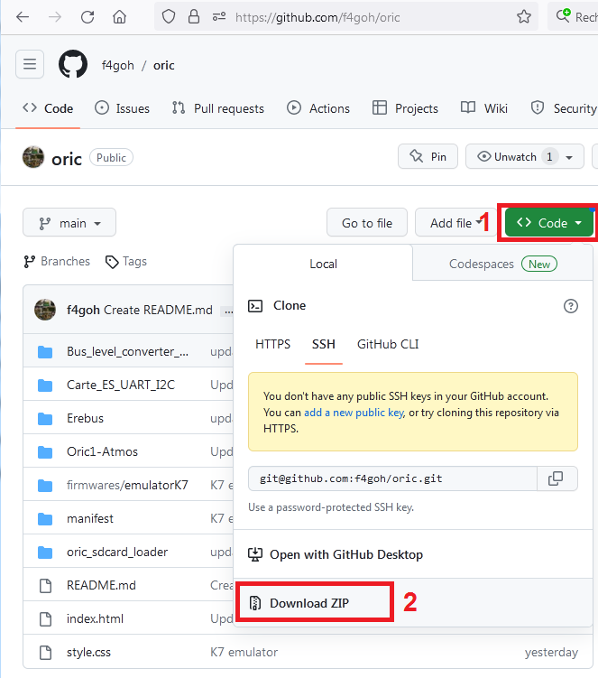

# oric

## 6502 [simulator](https://f4goh.github.io/oric/simulateur6502/) 

## ORIC text [simulator](https://f4goh.github.io/oric/simulateurOric/) 

## ORIC [gfxPaintV2](https://f4goh.github.io/oric/gfxPaintV2) 

## ORIC [gfxPaintV1](https://f4goh.github.io/oric/gfxPaintV1) 

## Oric hardware

## How to download ?

