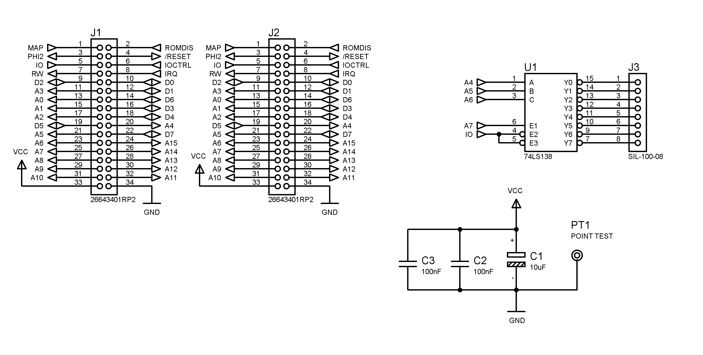

# Breadboard pour Oric

# Schéma de l'adaptateur

# Adresses du 74LS138

| Sorties | Adresse début | Adresse fin |
|---------|--------------|------------|
| Y0      | $380         | $38F       |
| Y1      | $390         | $39F       |
| Y2      | $3A0         | $3AF       |
| Y3      | $3B0         | $3BF       |
| Y4      | $3C0         | $3CF       |
| Y5      | $3D0         | $3DF       |
| Y6      | $3E0         | $3EF       |
| Y7      | $3F0         | $3FF       |

# Test avec un PIA 6821

# Test avec un PIA 8255

