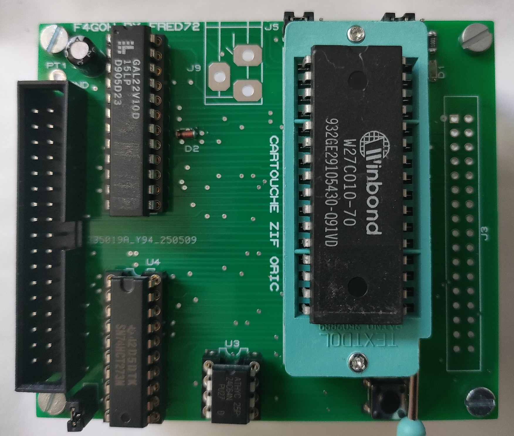
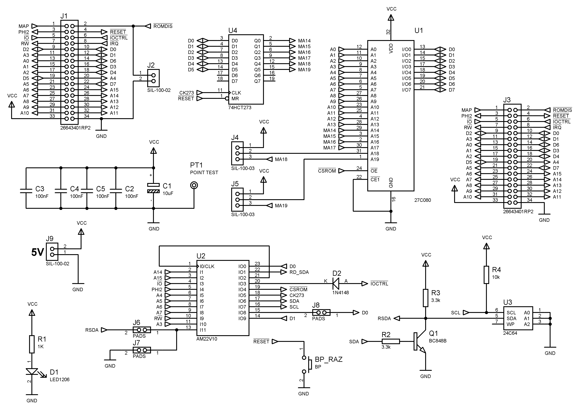
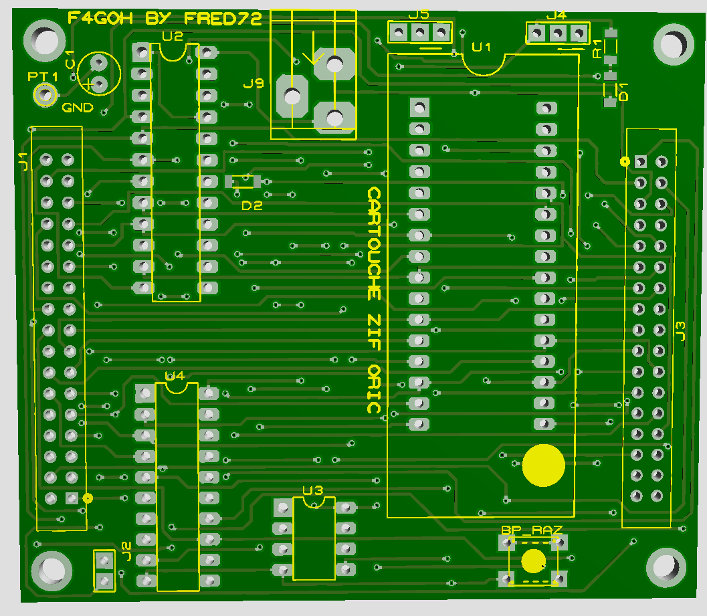
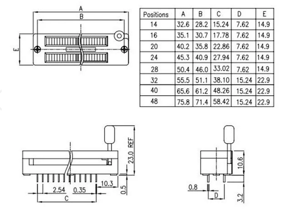

# Cartouche ZIF pour Oric

[D'après l'interface Cartouche FRED72](https://github.com/Fred72z/ORIC/tree/main/EXP_Cartouche)

[Voir forum.system-cfg.com](https://forum.system-cfg.com/viewtopic.php?f=18&t=16283)

# Schéma structurel

# PCB

# ZIF size

