# ORIC Atmos VGA Emulator Based on RP2040

## Overview

I designed and built an ORIC Atmos emulator running on the RP2040 microcontroller with VGA video output. The project is based on the excellent Pico-56 emulator available at:

https://github.com/visrealm/pico-56

However, the hardware has been completely redesigned around a custom PCB to better match the requirements of the ORIC platform and to integrate additional peripherals and features.

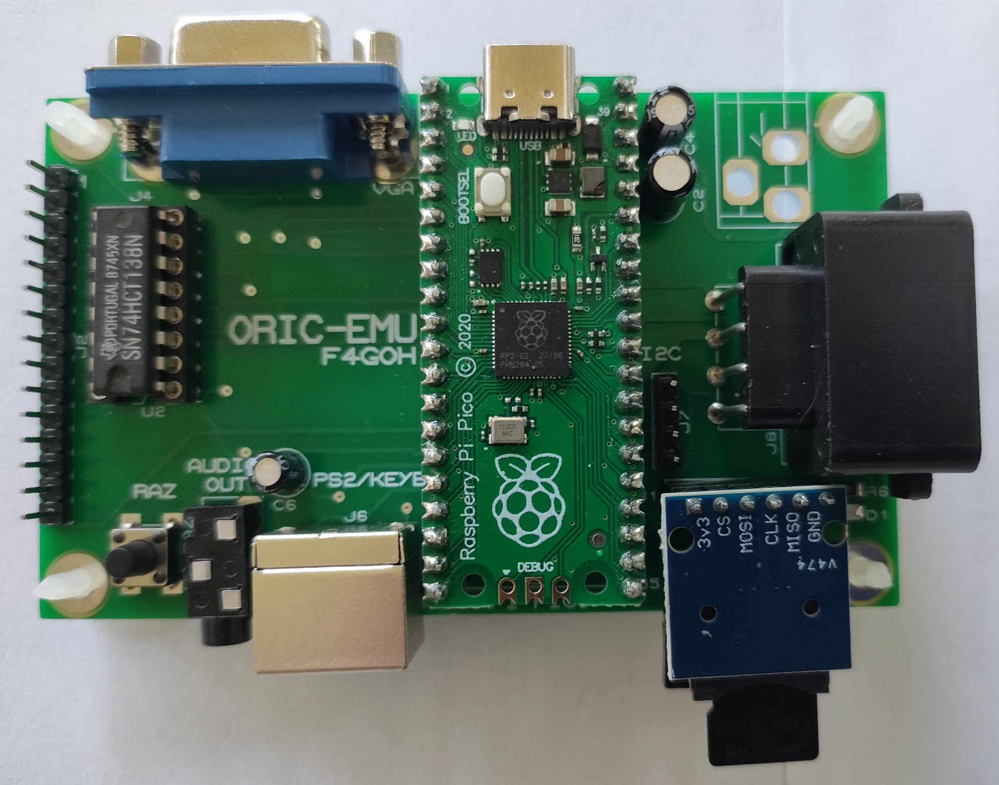

## Hardware

The emulator is built around a Raspberry Pi Pico (RP2040) and provides:

* VGA video output
* PS/2 keyboard support
* microSD card storage
* NES controller support
* I²C bus connectivity
* Audio output generated entirely in software
* Real Atmos keyboard

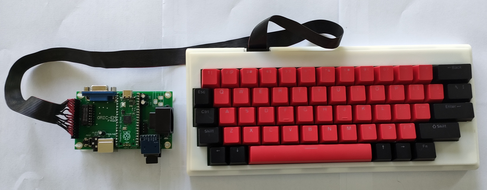

The NES gamepad proved to be an excellent choice. It is comfortable to use with both hands and requires only three signal wires, making integration simple and efficient.

## Game Loading System

Games are stored on the microSD card using two files per title:

* A `.tap` file containing the original ORIC tape image.
* A `.csv` file containing the game configuration.

For example:

```text
xenon.tap
xenon.csv
```

The CSV file stores:

* The game title.
* Controller-to-keyboard mappings used by the emulator.

[NES → ORIC-EMU Mapper](https://f4goh.github.io/oric/oric-emu/)

Loading times are extremely fast compared to the original tape system.

Most games run correctly, although a few titles such as *Frelon* still require investigation, as they stop after the introduction screen.

## Audio Emulation

The AY-3-8910 sound chip is fully emulated in software.

The audio quality is excellent, and I cannot hear any noticeable difference compared to the original hardware. The implementation also allows additional virtual AY chips to be mapped at dedicated addresses. Audio mixing is handled automatically by the emulator.

## Peripheral Emulation

### ACIA 6551

The ACIA 6551 (J5) serial interface has been successfully emulated and is fully operational.
* gpio 12 TX
* gpio 13 RX

### I²C Bus

The I²C bus (J7) implementation is working correctly. The remaining task is to add dedicated monitor commands to simplify bus management and peripheral control.
* gpio 20 SDA
* gpio 21 SCL


## Built-In Monitor and Development Tools

Several development and debugging tools have been integrated directly into the emulator:

* Memory viewer
* 6502 disassembler
* Memory block save to microSD card
* Snapshot functionality
* Screen capture export to BMP image files

These tools greatly simplify software development, debugging, and system analysis.

## Tape Support

The `CSAVE` functionality has now been completed and is fully operational, allowing programs and data to be saved using ORIC-compatible mechanisms.

## Current Status

The emulator already provides:

* Accurate ORIC Atmos emulation
* VGA output
* PS/2 keyboard support
* NES controller support 
* Fast game loading from microSD
* AY-3-8910 audio emulation
* ACIA 6551 emulation
* Memory monitor and disassembler
* Snapshot support
* BMP screen capture
* I²C bus support
* CSAVE functionality

Future work will mainly focus on improving compatibility with a few remaining games and expanding the monitor with dedicated I²C management commands.

The project demonstrates that a modern RP2040 microcontroller is powerful enough to recreate the ORIC Atmos experience while adding features that would have been impossible on the original hardware.

## The prototype

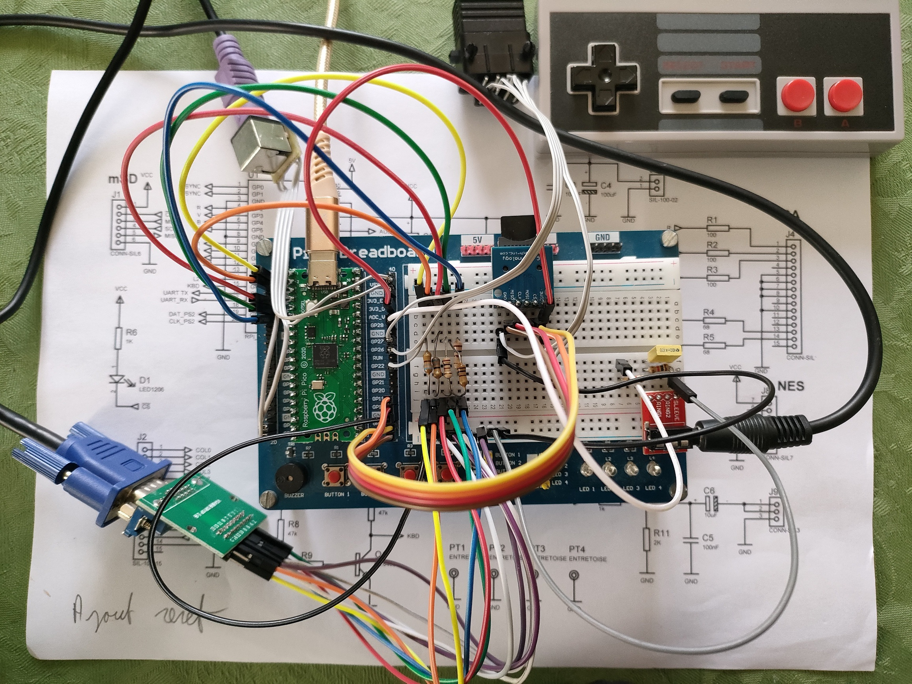

## Inside the monitor and some print screen

| | |
|---|---|
| 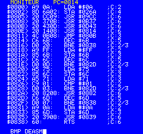 | 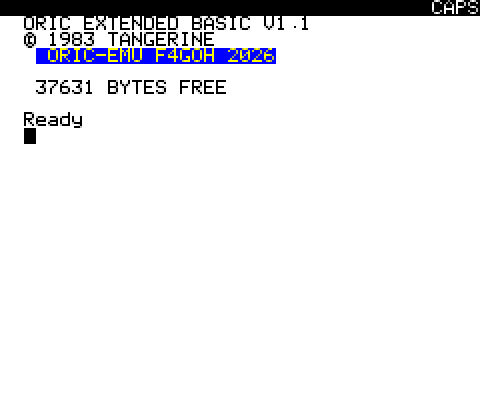 |
| 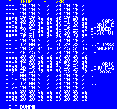 | 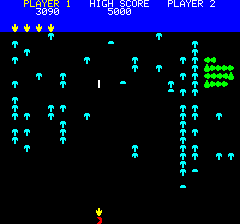 |
| 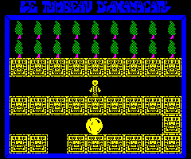 | 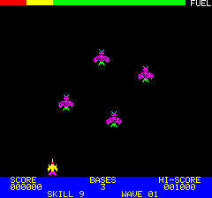 |
|  |  |

## Hardware 

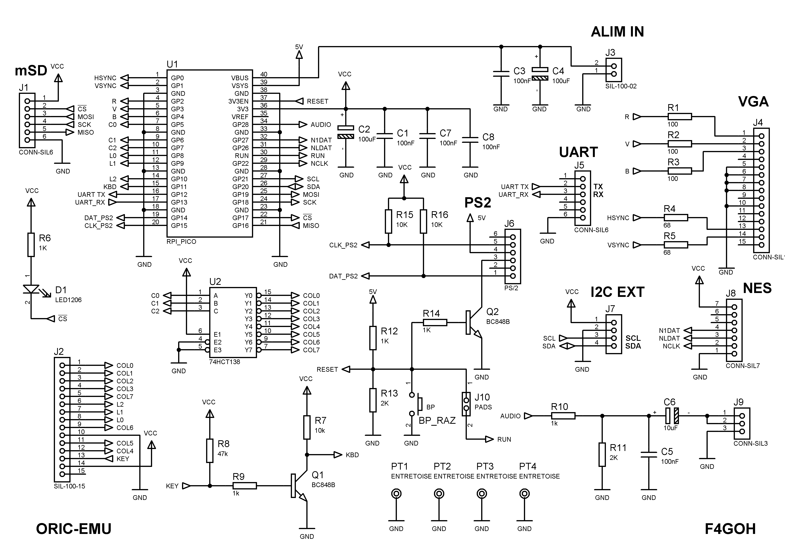

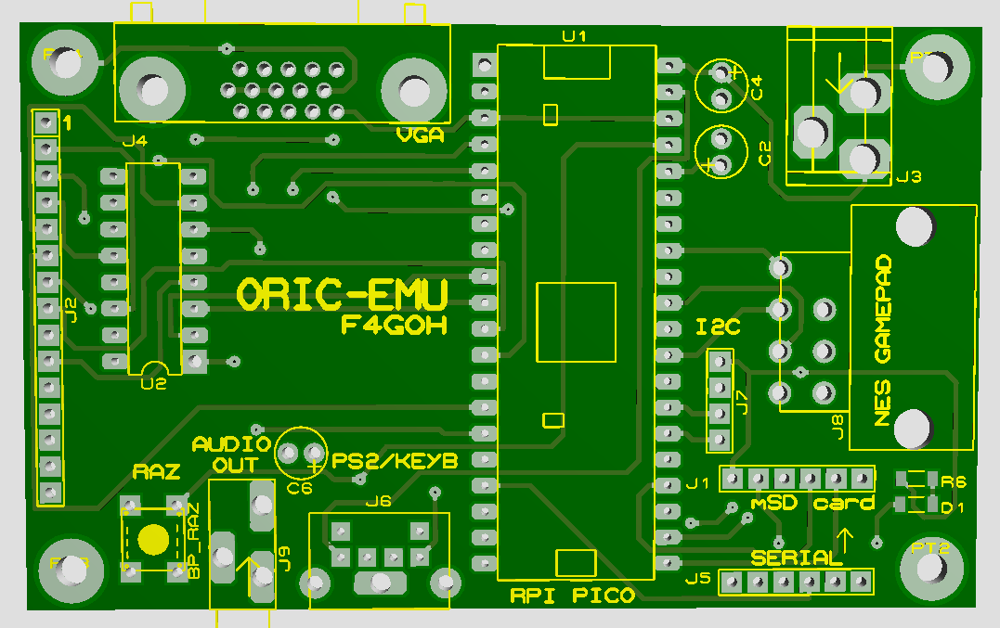

## BOM

| Catégorie | Qté | Références | Valeur / Composant |
|------------|----:|------------|-------------------|
| Résistance | 3 | R1-R3 | 100 Ω |
| Résistance | 2 | R4, R5 | 68 Ω |
| Résistance | 5 | R6, R9, R10, R12, R14 | 1 kΩ |
| Résistance | 3 | R7, R15, R16 | 10 kΩ |
| Résistance | 1 | R8 | 47 kΩ |
| Résistance | 2 | R11, R13 | 2 kΩ |
| Condensateur | 5 | C1, C3, C5, C7, C8 | 100 nF |
| Condensateur | 2 | C2, C4 | 100 µF |
| Condensateur | 1 | C6 | 10 µF |
| Circuit intégré | 1 | U1 | RPI_PICO |
| Circuit intégré | 1 | U2 | 74HCT138 |
| Transistor | 2 | Q1, Q2 | BC848B |
| Diode | 1 | D1 | LED1206 |
| Divers | 1 | BP_RAZ | BP |
| Divers | 2 | J1, J5 | CONN-SIL6 |
| Divers | 1 | J2 | SIL-100-15 |
| Divers | 1 | J3 | SIL-100-02 |
| Divers | 1 | J4 | CONN-SIL15 |
| Divers | 1 | J6 | PS/2 |
| Divers | 1 | J7 | — |
| Divers | 1 | J8 | CONN-SIL7 |
| Divers | 1 | J9 | CONN-SIL3 |
| Divers | 1 | J10 | PADS |
| Divers | 4 | PT1-PT4 | ENTRETOISE |


