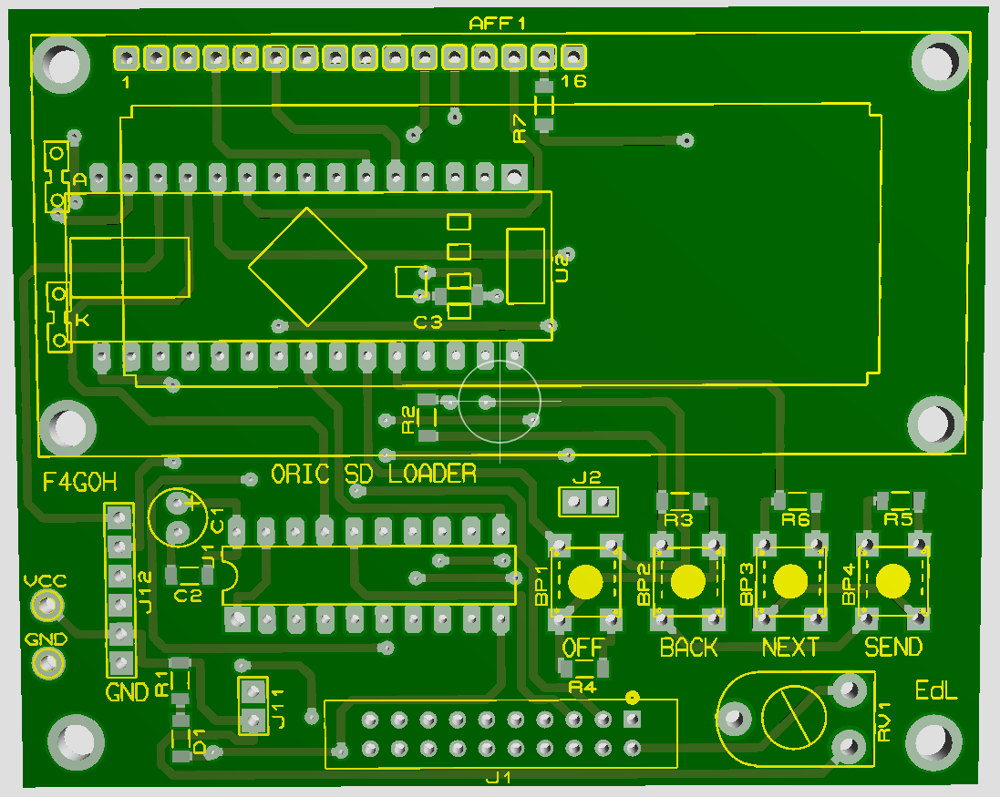

# oric_sdcard_loader
## _Alternative à l'Erebus en utilisant le port imprimante_

# [EdL42](https://forum.defence-force.org/viewtopic.php?t=1860) 

Ce projet reprend le schéma d'origine, mais avec la réalisation d'un circuit imprimé

## MATERIEL NECESSAIRE:

- Un module Arduino Nano (ou équivalent) à base d'Atmel 328 (pour avoir suffisament de ports d'entrées/sorties) avec son cable USB pour pour pouvoir le relier à un ordi et le programmer.
- Un module micro SD card AVEC régulateur incorporé (pour convertir le 5V en 3,3V).
- Une carte micro SD (la plus petite possible car les programmes Oric ne font que quelques dizaines Ko à chaque fois !).
- Un afficheur LCD 2 lignes de 16 caractères (pour afficher les noms des programmes et autre messages).
- Un classique buffer TTL 74LS244 que vous pouvez éventuellement remplacer par un 74HC244 plus moderne je pense.
- 4 boutons poussoir (j'ai utilisé un micro joystick 4 directions qui attendait là de servir à quelque chose depuis des années. Petit joystick ton heure est venue !).
- 4 résistances de 4,7 Kohms et une de 1 Kohms (pour les boutons).
- Une résistance de 220 ohms pour le rétro-éclairage de l'afficheur et une de 1,5 Kohms pour le contraste.
- Un connecteur 2x10 broches à sertir pour le port imprimante de l'Oric.
- Un bout de cable en nappe 20 conducteurs.
- Un bout de barrette male droite avec au moins 11 broches. 
- Une plaque d'essai 830 points (au moins) avec ses cables.

Vous devriez pouvoir tout trouver sur ebay, sur les magasins on-lines ou dans les magasins physiques de composants électroniques.

Il faudra également:
- Le code du programme de l'Arduino qui charge la liste des fichiers de la carte SD et envoi le fichier sélectionné à l'Oric ci-dessous:

- La ROM Oric patchée ci-dessous. Pour le moment uniquement la version Oric-1 (car c'est la plus compatible avec les jeux):
Il vous faudra aussi une eprom 27128 (16 Ko) et un moyen de la programmer.

# QUELQUES COMMENTAIRES (à lire attentivement svp):

## Le module Arduino Nano 328:

- 30 Ko de mémoire FLASH pour les programmes. Seulement un tiers est utilisé, donc plein de place pour des améliorations.

- 2Ko (seulement!) de RAM, donc au final 50 fichiers max pourront être chargés dans la liste, car il ne reste qu'1 Ko pour la table du directory.

- 14 entrées/sorties numériques (D0..D13):
- TX(D)1 et RX(D)0 sont déjà utilisés par le module pour la communication USB. Heureusement ils ont chacun une résistance de rappel de 1 Ko. Donc j'ai réutilisé ces broches pour les signaux Strobe et Ack avec l'Oric. MAIS IL FAUT PENSER A DECONNECTER TEMPORAIREMENT RX0 DE LA BROCHE STROBE POUR POUVOIR PROGRAMMER L'ARDUINO autrement cela produit une erreur ! On peut ajouter un interrupteur sur cette broche.
- D2 à D7 sont utilisés pour l'afficheur LCD.
'''c
      #define pinLCD_E  2               // Enable
      #define pinLCD_RS 3               // Register Select
      #define pinLCD_D4 4               // Data 4 (4 bits configuration)
      #define pinLCD_D5 5               // Data 5 (4 bits configuration)
      #define pinLCD_D6 6               // Data 6 (4 bits configuration)
      #define pinLCD_D7 7               // Data 7 (4 bits configuration)
'''
- D8 et D9 sont utilisés pour les données à transmettre via le port imprimante (voir ci-dessous pourquoi).
- D10 à D13 sont utilisées pour la communication avec la carte SD.
'''c
      #define pinCS 10                  // pin CS (SS) SD card (SPI)
      // Pin 11                            pin MOSI pour SD card (SPI) by default
      // Pin 12                            pin MISO pour SD card (SPI) by default
      // Pin 13                            pin SCK pour SD card (SPI) by default
'''
-> 8 entrées analogiques (A0..A7):
- Heureusement elles peuvent aussi être configurées en entrées/sorties numériques, MAIS PAS POUR A6 et A7 ! Donc A0 et A5 sont utilisées pour les données (bits) Data 0 à Data 5 et D8 et D9 sont utilisées en plus pour Data 6 et Data 7.
- A6 et A7 sont les seules entrés/sorties restantes pour les buttons mais elles sont analogiques. Donc elles sont connectées sur un diviseur de tension. 2 résistances divisent la tension de 5V. Les boutons sont regroupés par 2. Lorsqu'aucun bouton n'est enfonçé, A6 et A7 recoivent approximativement 1,9V. Si "UP" est enfonçé par exemple, alors une résistance est court-circuitée et la tension augmente à 3.4V (pas 5V car il y'a un résistance additionnelle de protection). Si "DOWN" est enfonçé alors c'est l'autre résistance qui est court-circuitée et la tension descend à 0V.
'''c
      #define pinOUT0 A0                 // Data 0 (output)
      #define pinOUT1 A1                 // Data 1 (output)
      #define pinOUT2 A2                 // Data 2 (output)
      #define pinOUT3 A3                 // Data 3 (output)
      #define pinOUT4 A4                 // Data 4 (output)
      #define pinOUT5 A5                 // Data 5 (output)
      #define pinOUT6 8                  // Data 6 (output. Using D8 as A6 an analog input only)
      #define pinOUT7 9                  // Data 7 (output. Using D9 as A7 an analog input only)
      #define pinACK 1                   // "Ack" Oric = CA1. TX1 (OUT). If = 0 then data ready to be read by Oric
      #define pinSTROBE 0                // "Strobe" Oric = PB4. RX0 (IN). Used as a more simple "Busy" signal actually. If = 0 then Oric is ready to receive data
'''
- Pour l'instant le montage est alimenté par le cable USB. Il faudra ajouter un fil pour récupérer le +5V du port d'extension de l'Oric.

## Le port imprimante de l'Oric:

- Le port imprimante (en réalité le circuit VIA 6522) est paramétré en entrée (et non en sortie).
- La broche Strobe est gérée par l'Oric et utilisée comme un signal Busy (occupé) ce qui est plus simple à gérer qu'un signal Strobe. La broche Strobe est en réalité connectée à la broche PB4 (port B) du 6522.
- Le signal Ack est généré par le module Arduino lorsque des données sont prêtes à être lues dans le buffer.
- Strobe = 1 => l'Oric n'est pas prêt.
- Strobe = 0 => l'Oric est prêt à recevoir des données.
- Ack = 1    => Pas de données disponibles dans le buffer.
- Ack = 0    => Des données (un octet de 8 bits en fait) sont disponibles dans le buffer. Ack est mis à 0 pour une courte période (100 micro secondes). Attention à ne pas trop la réduire ou l'Oric n'aura plus assez de temps pour lire les données.

## Le chargeur:

J'ai d'abord écrit un petit programme en assembleur sur l'Oric pour pouvoir recevoir les données. Puis j'ai décidé de patcher la ROM de l'Oric de façon à ce que la fonction CLOAD puisse être utilisée comme d'habitude sauf qu'elle va lire les données sur le port imprimante.
Ce que fait le chargeur:
- Désactive les interruptions.
- Configure la broche Ack pin (c'est-à-dire la broche CA1 du 6522) pour détecter un front "descendant" (transition de 1 à 0).
- Configure le port imprimante (c'est-à-dire le port A du 6522) en entrée.
- Affiche "Searching..."
- Recoit l'amorce du fichier (0x16, 0x16, 0x16).
- Recoit l'octet de synchronisation (0x24).
- Recoit l'entête du fichier (nom fichier, addresse de début, addresse de fin, type de fichier: Basic ou LM, auto ou non).
- Affiche "Loading..." + nom fichier.
- Recoit le contenu  du fichier jusqu'à ce que l'adresse de fin soit atteinte.
- Réactive les interruptions.
- Lance le programme chargé (si auto) ou renvoi au prompt Basic.

	  
## ET MAINTENANT COMMENT S'EN SERVIR :-) ?

Boutons:
UP (HAUT)      => fichier précédent dans la liste.
DOWN (BAS)     => fichier suivant dans la liste.
RIGHT (DROITE) => envoi le fichier sélectionné !
LEFT (GAUCHE)  => désactive la carte SD card proprement.

- Branchez le montage au port imprimante de l'Oric.
- Formatez la carte micro SD card en FAT32 (ca devrait aussi pouvoir marcher en FAT16). La fragmentation des fichiers n'est pas supportée. Evitez de supprimer puis ajouter des fichiers sur la carte. Il vaut mieux la reformater (très rapide) et remettre les fichiers dessus.
- Copiez un maximum de 50 (voir ci dessous pourquoi) fichiers Oric "XXXXXXXX.TAP" dessus. Seuls les noms courts (8 + 3) sont supportés donc pensez à les renommer le cas échéant (avant de faire la copie)).
- Retirez la carte SD et insérez là dans le module SD.
- Connectez le module Arduino à un ordi via le cable USB, ouvrir le programme Arduino dans l'interface Arduino et le compiler pour vérification. Avec la version 1.8.5 actuelle, il doit se compiler sans problème car tout le code est contenu dans un seul fichier. 
- Déconnectez RX0 de Strobe (voir au-dessus pourquoi).
- Programmer l'Arduino. Il doit redémarrer et "Loading dir..." doit s'afficher sur le LCD, puis les 2 premiers fichiers trouvés. NB: toute cette opération n'est à faire que la première fois bien sûr.
- Reconnectez RX0 à Strobe (voir au-dessus pourquoi).
- Naviguez dans la liste des fichiers avec les boutons "UP" et "DOWN".
- Allumez l'Oric. Tapez CLOAD"" puis appuyez sur RETURN. Vous devez avoir patché la ROM de l'Oric de façon à ce qu'il aille lire les données sur le port imprimante.
- L'Oric doit afficher "Searching...".
- Envoyez le fichier choisi en appuyant sur le bouton "RIGHT".
- Le message "Sending..." + taille du fichier doit apparaitre sur le LCD. Il y'a un timeout (2 min.) si l'Oric ne répond pas.
- L'Oric doit afficher "Loading..." + nom du fichier.
- Habituellement cela prends moins de 5 (!) secondes pour charger un fichier. En en bonus cela fonctionne aussi avec les programmes en plusieurs parties du moment qu'ils appellent la fonction CLOAD en ROM et que le timeout ne soit pas atteint.
- Le message "File sent !" doit s'afficher sur le LCD.
- Le programme doit démarrer automatiquement sur l'Oric (s'il est en mode AUTO, comme par exemple un jeu).
- Lorsque vous avez terminé ou si vous souhaitez changer le contenu de la carte SD, n'oubliez pas de la désactiver proprement avec le bouton "LEFT" pour éviter toute corruption de données.

[Voici une démo](https://youtu.be/KIy44OiyAuc)

